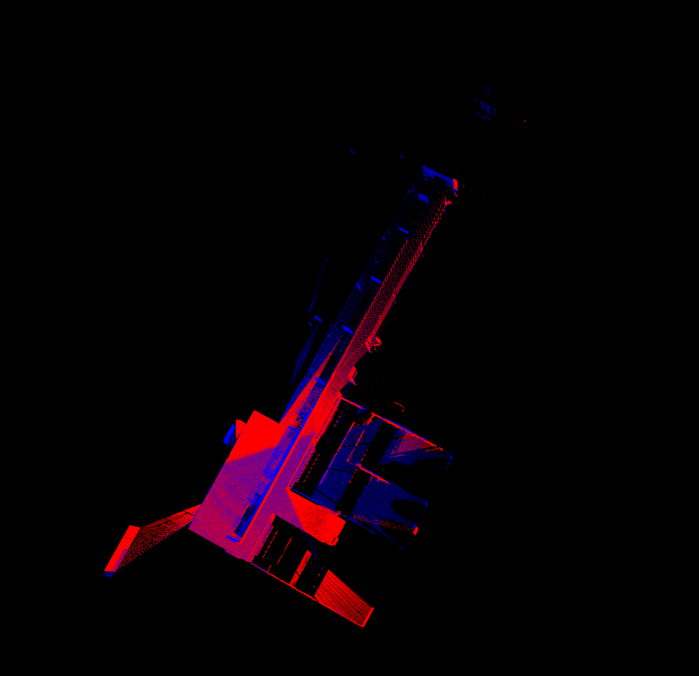
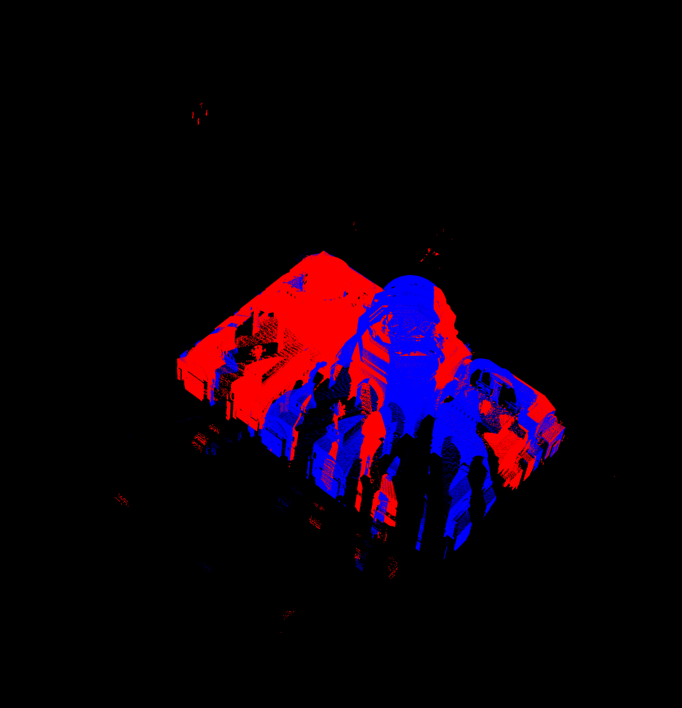
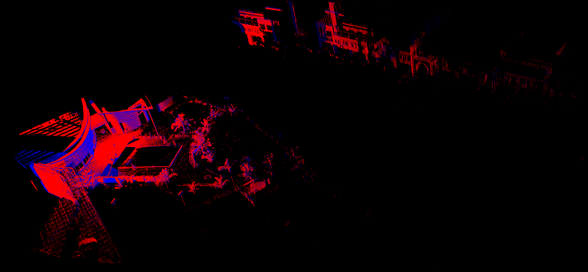
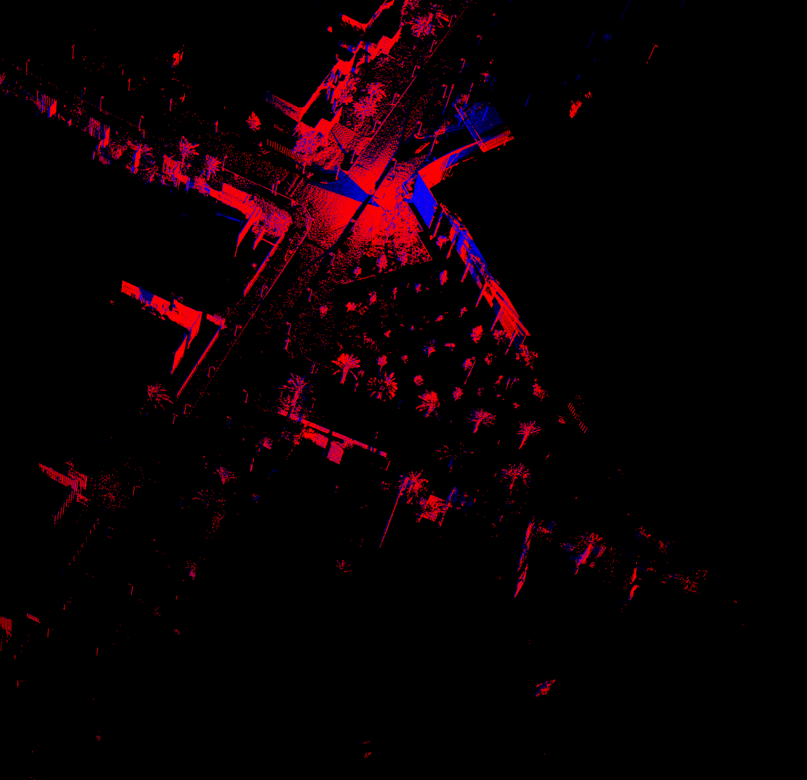

# Pairwise Coarse Registration of Point Clouds by Traversing Voxel-Based 2-Plane Bases

Unofficial implementation of paper ["Pairwaise coarse registration of point clouds by traversing voxel-based 2 plane
bases"](https://www.tandfonline.com/doi/epdf/10.1080/01431161.2022.2130725?needAccess=true&role=button)

## Paper details

The paper aims at estimating a rough transformation between two point clouds. The method is based on the following
steps:

1. Voxel-based planes are extracted from the entire point cloud wiht 3D cubic grids decomposed by the octree-based
   voxelization. A plane is defined by a normal vector and a distance (positive).
2. Bases are generated from the planes. A base is composed of two planes with a dihadral angle $`\alpha \in [10°, 80°]`$
3. Bases from the source cloud are compared to those from the target cloud to find a corresponding match (equal angles)
    1. For two possibly corresponding bases, a rotation is estimated to align the two bases (collinear normal vectors)
    2. Using the rotated cloud, find correspondences between the source planes and the target planes. Planes are
       correspondent if:
        1. For a plane `sPi` (source plane i), find the most collinear plane `tPj` (target plane j)
        2. For a plane `tPj`, find the most collinear plane `sPh`
        3. if `h == i` then `sPi` and `tPj` are correspondent.
    3. Using this list of correspondences, find the transformation between the two clouds to minimize the distance
       between the planes.
    4. Compute the optimal correspondence. Additionally, to `3.ii.`, Planes are correspondent if the distance between
       them is smaller than a threshold $`d_{max}`$

## Additional Changes to the paper

1. The angle between the planes to generate bases is augmented to 110°. This way, we can generate a base as a plane from
   the floor and a plane from the wall.
2. The same plane is only generated once to avoid redundant computation.
3. When computing the LCP score, the number of planes generated are taken into account. If a plane is generated twice,
   the LCP takes that into account.
4. When assigning correspondences between planes, the correspondence between the bases being processed is encouraged. If
   one of the bases is corresponded to the other, but not the other way around, we force the correspondence to be
   mutual.
5. This implementation aims at registering point clouds taken by sensors correctly oriented on the Z axis. As such, we
   force the rotation to be only on the Z axis.
6. A loop over the parameters (voxel_size, minimum number of points per voxel, planarity score) is implemented
   in `main.cpp` and the result that aligns the most planes in the two clouds is selected. (This point has not shown any
   improvement in the tried results).

### Justification of the changes

An ablation study has been conducted on a particular example (`data/data/0010`) to justify the changes. The results can
be found in `data/lidar_lidar/0_5-300-0_5-300-0_6/0010/ablation_study`
and `data/lidar_rgbd/0_5-300-0_5-300-0_6/0010/ablation_study`. The ablation study shows that the changes made to the
paper improve the registration results.

## Repository structure

```
├── README.md
├── CMakeLists.txt
├── main.cpp
├── tools --> containing the classes and functions for tools used to process pointclouds, perform the registration and visualize the results
│   ├── CMakeLists.txt
│   ├── include
│   └── src
├── custom_lib --> containing the classes and functions for customized pcl objects
│   ├── CMakeLists.txt
│   ├── include
│   └── src
└── data --> containing the data for the registration
    ├── data
    │   ├── 0001
    │   │   ├── 0001_setup.png
    │   │   ├── lidar_0_0_*.pcd
    │   │   ├── lidar_0_1_*.pcd
    │   │   ├── rgbd_0_0_*.pcd
    │   │   └── rgbd_0_1_*.pcd
    │   ├── 0002
    │   ├── 0003
    │   ├── 0004
    │   ├── 0005
    │   ├── 0006
    │   ├── 0007
    │   ├── 0008
    │   ├── 0009
    │   └── 0010
    ├── lidar_lidar --> containing the lidar-lidar registration results
    └── lidar_rgbd --> containing the lidar-rgbd registration results
```

## Usage

1. Clone the repository
2. Create a build directory and compile the code `cmake .. && make`
3. Run the code with the following arguments:

```
./main <path_source_cloud> <path_target_cloud> <voxel_size_source_cloud> <minimum_nb_points_per_voxel_source> <voxel_size_target_cloud> <minimum_nb_points_per_voxel_target> <planarity_score>
```

Example:

```
./main ../data/data/0010/lidar_0_0* ../data/data/0010/rgbd_0_1* 0.5 300 0.5 300 0.6
```

## Tests

Results from the paper on [RESSO dataset](https://3d.bk.tudelft.nl/liangliang/publications/2019/plade/resso.html) can be reproduced (with the right choice of parameters):

| Figure | Result of Registration                                             |
|--------|--------------------------------------------------------------------|
| 6i     |  |
| 6j     |  |
| 7d     |  |
| 7e     |  |


